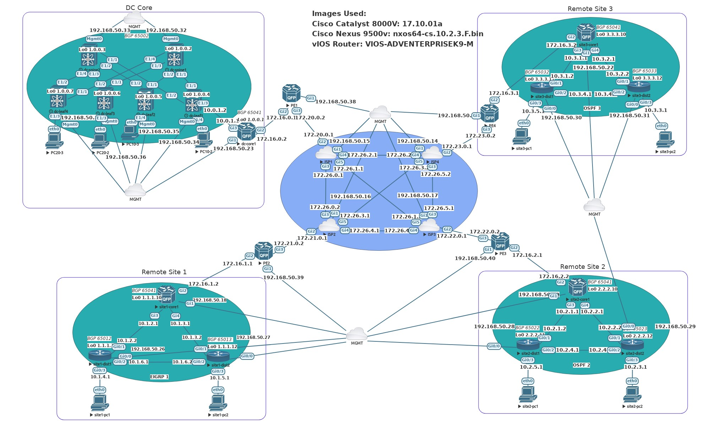

# Ansible Automation of Remote Sites through Cisco SDWAN

This repo is a lab POC in EVE-NG using Cisco SDWAN to connect 3 remote sites to a DC Core site.
The SDWAN is manually configured through CLI and vManager. The entire Cisco network devices,
including the ISP routers were configured through Ansible network automation using Jinja2
templates and Ansible roles. Cisco IOSXE devices were all configure through RESTCONF while
vIOS routers were configured through the Ansible ios_config module. All BGP configurations were
done through Jinja2 templates in Ansible roles using the ios_config module.

## Images Used

Viptela: 20.6.1
Cisco Catalyst 8000V: 17.10.01a
vIOS Router: VIOS-ADVENTERPRISEK9-M

## EVE-NG Lab File

The EVE-NG lab file was exported and is available in the repo for you to import into EVE-NG yourself.

eve-ng-ansible-sdwan.zip

## Cisco SDWAN Details

The SDWAN control zone sits in a simulate cloud/remote site with publically reachable IP
addresses (172.30.0.0/24 network). VPN512 management is connected to Cloud0 MGMT network for which
the EVE-NG physical server has a dedicated network card bridged to. This automation POC does not cover 
the setup of SDWAN as the SDWAN fabric was configured manually and will require prior Cisco SDWAN knowledge.
However, you can use the lab to practice Cisco SDWAN installion and configuration if you so choose. You DO NOT
need to configure SDWAN devices in order to the do Ansible network automation step as this is done entirely
through the simulated OOB MGMT network. If you don't configure SDWAN, you just won't have connectivity between
remote sites, the DC Core, or the simulated public ISP network. You will have full eBGP network connectivity local
to each remote site though.

## Network Details

The MGMT Cloud0 network (192.168.50.0/24) is the only connection to devices outside of the EVE-NG lab. 
All IP class A and B private networks can only connect within the EVE-NG lab. Class B private networks
are used to simulate Internet connectivity while Class A private networks used to simulate private
networks.

All remote sites and the DC Core use eBGP for global connectivity through the SDWAN OMP protocol. Each
remote site runs either EIGRP or OSPF internally for eBGP to have connectivity to neighbor peers through
loopback interfaces.

## ISP Details

Three Cisco Catalyst 8000V are used to simulate 3 individual ISP networks, with each vEdge device being
dual homed to 2 ISPs.

## DC Core

The DC Core site only uses eBGP to propogate routes through the simulated corporate network.

## Remote Site Details

Remote Site 1 routers are running EIGRP for eBGP to have peer neighbor connectivity. Remote Site 2 and 3
both run OSPF.

## Initial Configuration i.e. Bootstrap Configs

Using EVE-NG options, all Cisco network devices and VPCs have basic bootstrap startup configurations to allow
you to connect to them through the MGMT network and run automation scripts against them. The startup configurations
were saved to EVE-NG startup configs so you can wipe any Cisco network device to start over again with automation.

One thing to note, the vIOS routers would not accept their static IP address for their MGMT network connection and
each vIOS router required an extra step to manually configure the MGMT network.

## Default Username and Passwords

All Cisco devices use local authentication with the username admin and password of admin.

## Setup Order

The YAML files in the main directory with numbers in front, i.e. 1_isp.yml are the order that I automated
the entire network. You can run them in any order of your choice since they are completely independant of
each other.

## POC Next Steps

I plan on looking into fully automating the installation of Cisco SDWAN as it appears Cisco has released
Ansible modules to do this. Also, to keep this lab POC hardware requirements low, I skipped out on integrating
Cisco ISE, a domain controller, and Cisco FMC with a FTD. My intention is to integrate these also through Ansible
automation. Following that completion, I want to use TREx to generate some simulated WAN traffic and use 
model driven telemetry with the Telegraf, Influxdb, Grafana (TIG) stack for networking monitoring through
push subscriptions in Cisco IOSXE devices.
